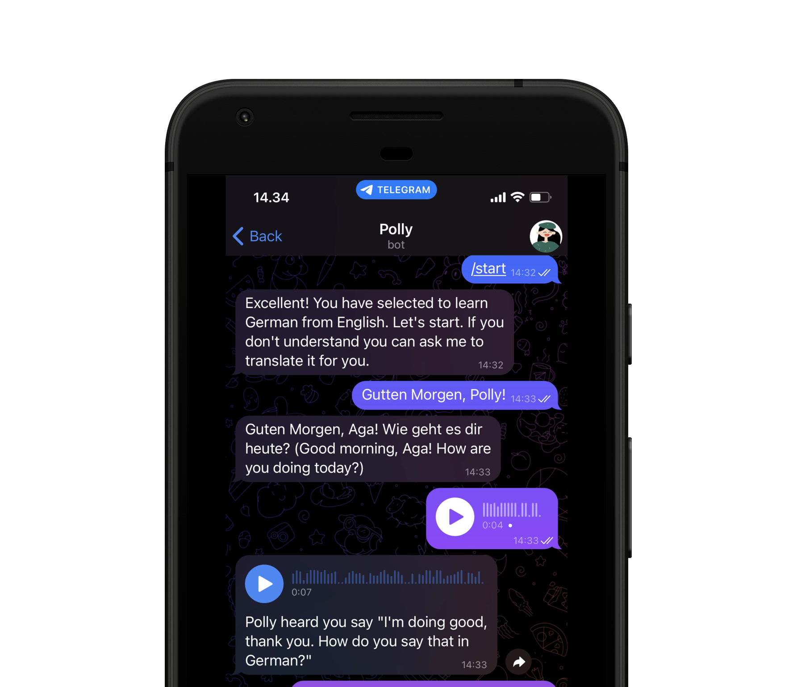

# Polly

> Language Learning Chatbot with GPT 3.5



Polly is chatbot built for interactive learning of foreign languages. 
It is able to accept multiple forms of messages (text, voice, etc.) to enhance the learning experience.
This was built specifically for the Telegram Messenger with goals to expand as an
omnichannel chatbot.

[View Changelog](CHANGELOG.md)

## Prerequisite

This implementation requires third-party connectivity as follows:
- OpenAI (Whisper & ChatGPT 3.5+)
- Google Cloud API (Text-to-Speech)
- Telegram API
- Database (PostgreSQL)
- Redis

Fill the required configurations within the `.env` file or export each as an environment variable with the required names.

## Quick Start

```bash
~ pip install -r requirements.txt
~ python main.py
```

## Author
* Abhishta Gatya ([Email](mailto:abhishtagatya@yahoo.com)) - Software and Machine Learning Engineer
* Nabeel Kahlil ([Email](mailto:spinedark@gmail.com)) - Software Engineer
